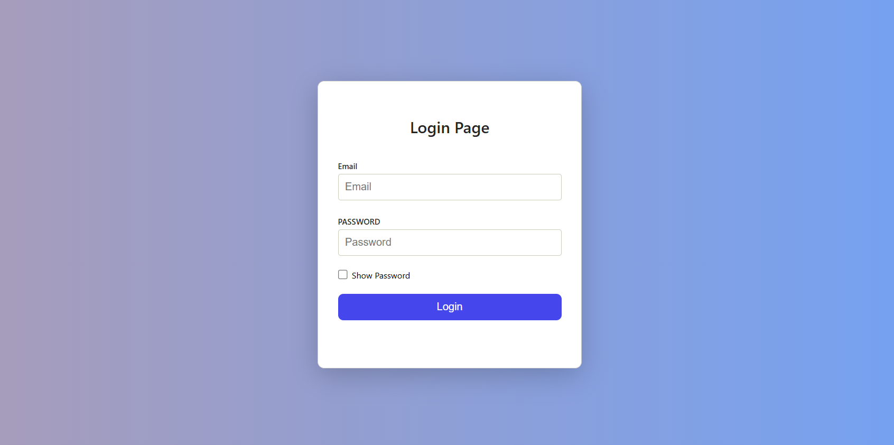
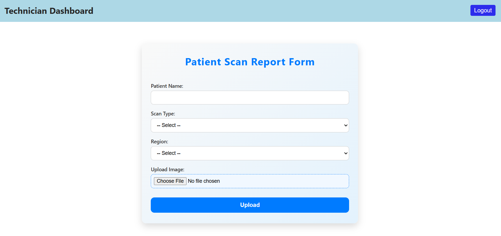
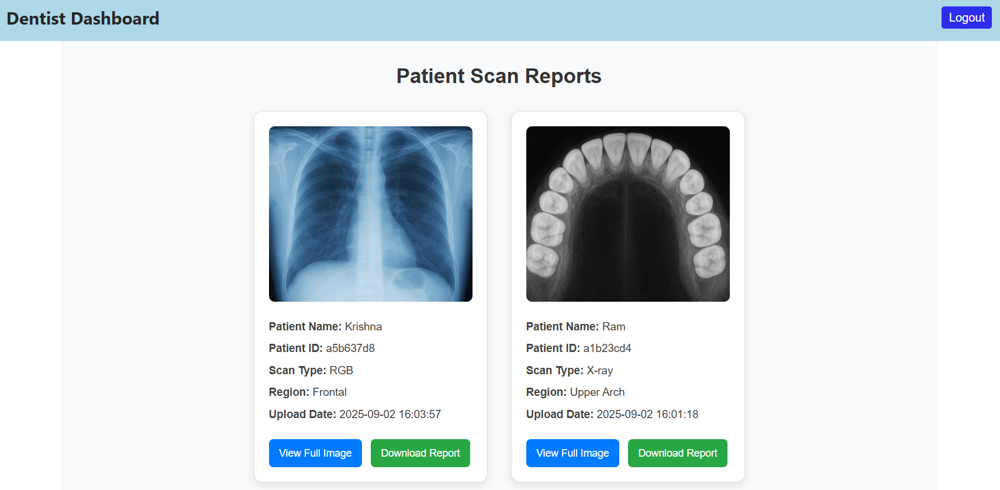

# OralVis Healthcare - Fullstack Web Application

## 1. Project Objective

The goal of this project is to build a full-stack web application for **OralVis Healthcare**, serving two user roles:

- **Technicians**: Upload patient dental scans.
- **Dentists**: View and download patient scan reports.

The application includes **role-based access**, **JWT authentication**, and **PDF report generation** for dental scans.

---

## 2. Tech Stack

### Frontend
- React.js (functional components with hooks)
- React Router (for routing)
- JS-Cookie (for JWT handling)
- jsPDF (for PDF report generation)
- UUID (for unique patient IDs)
- CSS (styling)

### Backend
- Node.js with Express.js
- SQLite (relational database)
- JWT (authentication)
- Multer & Cloudinary (file uploads)
- CORS (cross-origin requests)

---

## 3. Features

### Frontend
- **Login Page**: Role-based login with JWT authentication.
- **Technician Dashboard**:
  - Upload patient scans with details.
  - Validate all fields and display feedback messages.
- **Dentist Dashboard**:
  - View list of uploaded scans.
  - View full-size images.
  - Download scan reports as PDFs.
- **Header Component**: Shows dashboard title based on role and a logout button.

### Backend
- **User Authentication**: JWT-based login.
- **Role-based Routes**:
  - `/upload` → Technicians can upload scans.
  - `/scans` → Dentists can fetch scan data.
- **File Upload**: Images uploaded to Cloudinary.
- **Database**: Store patient info, scan type, region, and uploaded file URLs.

---

## 4. Screenshots

### Login Page


### Technician Dashboard (Upload Scan)


### Dentist Dashboard (View & Download Scan)


---

## 5. Live Demo
[OralVis Healthcare Live Demo](https://srinivas-oralvis-healthcare-frontend.vercel.app/)

---

## 6. Running the Project Locally

#### Backend
1. Navigate to backend:

```bash
cd backend
```

2. Install dependencies:

```bash
npm install
```

3. Start server:

```bash
npm start
```

Server runs on http://localhost:3000

#### Frontend
1. Navigate to frontend:

```bash
cd frontend
```

2. Install dependencies:

```bash
npm install
```

3. Start server:

```bash
npm start
```

App runs on http://localhost:3000

---

## 7. Default Login Credentials

#### Technician
- **Email:** srinu123@gmail.com
- **Password:** srinu@2022

#### Dentist
- **Email:** vasu123@gmail.com
- **Password:** vasu@2022

> Use these credentials to test both dashboards.

---

## 8. Notes
- JWT tokens are stored in cookies; clear cookies to logout.
- Technicians can only upload the patient scans reports; Dentists can only read the patient scan reports.
- PDF reports generated by Dentists include patient details and uploaded images.
